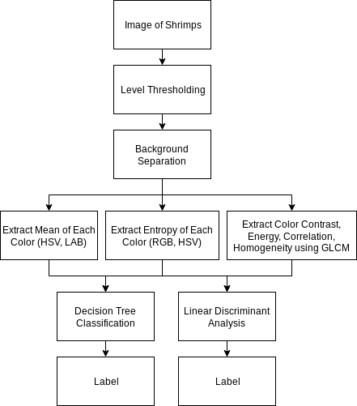

# OSK_ComVis_Shrimp Sorting

An assignment to sort shrimps quality from images

- Rama Lesmana
- M. Luthfi Albiansyah

## Link
- [Google Colab](https://colab.research.google.com/drive/1Y4NpwIJLg5NQp7SAtTUgavDMZJuc3ET3?usp=sharing)

## Method
The method is built from reference papers in folder ~[reference paper](https://github.com/Romeless/UAS_OSK110/tree/master/reference%20paper)

## Final Paper
The paper is found in [Final Paper.pdf](https://github.com/Romeless/UAS_OSK110/blob/master/Final%20Paper.pdf)
